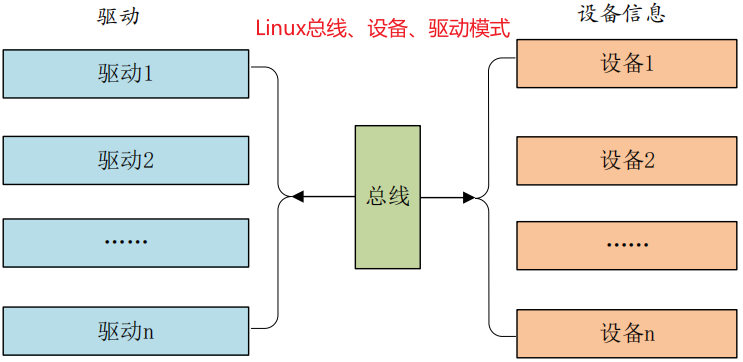

# platform 设备驱动


>从设备树当中获取到设备信息

向系统注册一个驱动时，总线会在右侧的设备中查找，看看有没有与之对应匹配的设备，有的话就将两者联系起来。
> 同样的，向系统注册一个设备时，总线会在左侧的驱动中查找匹配的驱动，将它们联系起来。

有些SOC中外设是没有总线这个概念，为此 Linux 提出了 platform 虚拟总线，相应的就有platform_driver 和 platform_device。

## platform总线

platform_bus_type 就是 platform 平台总线

```C
struct bus_type platform_bus_type = { 
    name = "platform",
    .dev_groups = platform_dev_groups,
    .match = platform_match, /*匹配驱动和设备*/
    .uevent = platform_uevent,
    .pm = &platform_dev_pm_ops,
};
```

>```C
>static int platform_match(struct device *dev, struct device_driver *drv)
>{
>    struct platform_device *pdev = to_platform_device(dev);
>    struct platform_driver *pdrv = to_platform_driver(drv);
>
>    /* When driver_override is set, only bind to the matching driver */
>    if (pdev->driver_override)
>        return !strcmp(pdev->driver_override, drv->name);
>
>    /* OF类型匹配，也就是设备树匹配 */
>    if (of_driver_match_device(dev, drv))
>    return 1;
>
>    /* ACPI匹配 */
>    if (acpi_driver_match_device(dev, drv))
>        return 1;
>
>    /* id table匹配 */
>    if (pdrv->id_table)
>        return platform_match_id(pdrv->id_table, pdev) != NULL;
>
>    /* 直接比较驱动和设备的 name 字段 */
>    return (strcmp(pdev->name, drv->name) == 0);
>}
>```
>
>驱动和设备设备有4种匹配方式

## platform驱动

platform_driver 结构体表示 platform 驱动。

```C
struct platform_driver {
    int (*probe)(struct platform_device *);
    int (*remove)(struct platform_device *);
    void (*shutdown)(struct platform_device *);
    int (*suspend)(struct platform_device *, pm_message_t state);
    int (*resume)(struct platform_device *);
    struct device_driver driver;
    const struct platform_device_id *id_table;
    bool prevent_deferred_probe;
10 };
```

>probe 函数，当驱动与设备匹配成功后就会执行。
>
>id_table 表，当使用 id table 匹配时会用到。id_table 就是个数组，数组元素类型为 platform_device_id。
>
>device_driver 结构体中有个成员 of_match_table ,用于采用设备树的时候驱动使用的匹配表。同样是个数组，数组元素类型为 of_device_id。
>of_device_id 中有个 compatible 成员，对于设备树而言，就是通过设备节点的 compatible 成员和 of_match_table 中每个项目的 compatible 成员变量进行匹配。

platform驱动框架如下:

```C
#include "include/led_driver.h"

struct xxx_dev xxxdev; /*定义设备结构体变量*/

/*
* 函数名称: open
* 函数功能:
* 函数备注:应用层调用open时自动执行该函数
*/
static int open( struct inode *inode, struct file *filp );
{
    return 0;
}

/*
* 函数名称: write
* 函数功能:
* 函数备注:应用层调用write时自动执行该函数
*/
static ssize_t write( struct file *filp, const char __user *buf, size_t cnt, loff_t *offt )
{
    return 0;
}

/*
* 结构名称：fops
* 结构类型：file_operations
* 结构备注：每一个设备号对应一个file_operations类型的结构，存放该驱动程序的各种操作函数
*/
static struct file_operations fops = {
    .owner = THIS_MODULE,
    .open = open,
    .write = write,
};

/*
* 函数名称: probe
* 函数功能:
* 函数备注: 驱动和设备匹配成功以后此函数就会执行
*/
static int probe( struct platform_device *dev )
{
    cdev_init( &xxxdev.cdev, &fops ); /*注册字符设备驱动*/

    return 0;
}

static int remove( struct platform_device *dev )
{
    cdev_del( &xxxdev.cdev ); /*删除 dev*/

    return 0;
}

/*
* 结构名称: of_match
* 结构功能: 驱动和设备匹配列表
*/
static const struct of_device_id of_match[] = {
    { .compatible = "xxx-gpio" },
    {},
};

/*
* 结构名称: driver
* 结构功能: platform 平台驱动结构体
*/
static struct platform_driver driver = {
    .driver  = {
        .name = "xxx",
        .of_match_table = of_match,
    },

    .probe = probe,
    .remove = remove,
};

/*
 * 函数名：driver_init
 * 功能描述：完成驱动的注册和调用其他注册函数
 * 备忘：加载驱动时自动调用该函数
*/
static int __init driver_init( void ) 
{
    return platform_driver_register( &driver ); /*数向 Linux 内核注册一个 platform 驱动*/
}

/*================================================================
 * 函数名：driver_exit
 * 功能描述：释放驱动相关资源
 * 备忘：驱动卸载时自动执行该函数
================================================================*/
static void __exit driver_exit( void )
{
    platform_driver_unregister( &driver ); /*卸载 platform 驱动*/
}

module_init( driver_init );
module_exit( driver_exit );

MODULE_LICENSE( "GPL" );
MODULE_AUTHOR( "YangMou" );
```
