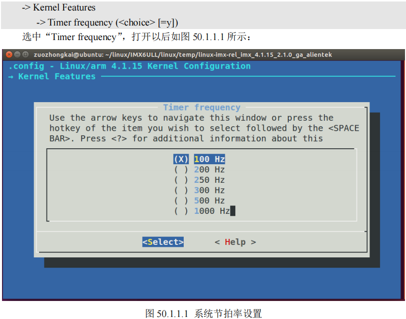
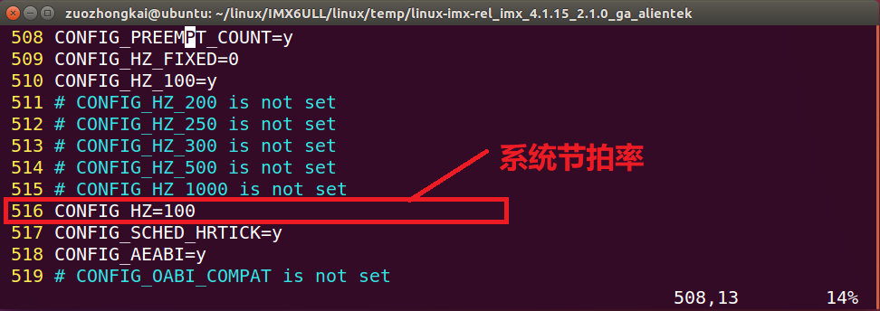

# 内核定时器

硬件定时器提供时钟源，时钟源的频率可设置，设置好以后就周期性的产生定时中断，**系统使用定时中断来计时**。

中断周期性产生的频率就是系统频率(也叫系统节拍率)，系统频率是可设置的，在编译 Linux 内核的时候可以通过图形化界面设置系统频率。


设置好以后打开 Linux 内核源码根目录下的.config 文件，在此文件中有如图所示定义：


100HZ表示10ms进一次中断，时间基准就是10ms。

Linux 内核使用全局变量 `jiffies` 来记录系统启动以来的系统节拍数，jiffies/HZ 就是系统运行时间。

---

Linux 内核使用 `timer_list` 表示内核定时器。内核定时器不是周期运行的，超时以后就会自动关闭，如果要实现周期性定时，需要在定时处理函数中重新开启定时器。

## init_timer 函数

`init_timer` 函数负责初始化 `timer_list` 变量

```C
void init_timer(struct timer_list *timer);
```

## add_timer 函数

`add_timer` 函数用于向 Linux 内核注册定时器，使用 `add_timer` 函数向内核注册定时器以后，定时器就会开始运行。

```C
void add_timer(struct timer_list *timer);
```

## 删除定时器

del_timer 函数用于删除一个定时器，不管定时器有没有被激活，都可以使用此函数删除。
> int del_timer(struct timer_list * timer)

del_timer_sync 函数是 del_timer 函数的同步版，会等待其他处理器使用完定时器再删除。
> int del_timer_sync(struct timer_list *timer)

## 修改定时值

mod_timer 函数用于修改定时值，**如果定时器还没有激活的话，mod_timer 函数会激活定时器**！
> int mod_timer(struct timer_list *timer, unsigned long expires)
